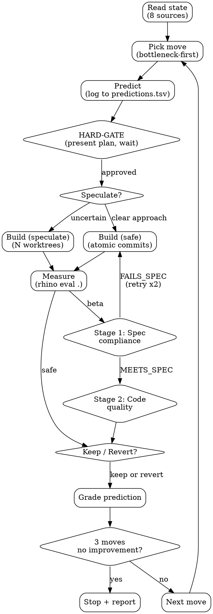

!cat .claude/cache/eval-cache.json 2>/dev/null | jq 'to_entries | map({key, score: .value.score, delta: .value.delta}) | from_entries' 2>/dev/null || echo "no eval cache"
!tail -3 ~/.claude/knowledge/predictions.tsv 2>/dev/null || echo "no predictions"

# /go

Autonomous creation loop. Plan, predict, build, measure, learn — no human in the loop until you hit a wall or plateau.

**Status: BETA.** Speculative branching, adversarial review, and mechanical prediction grading are experimental. Use `--safe` to disable beta features and run the proven sequential loop.

## Modes

- **`/go`** — full beta loop with speculative branching + adversarial review
- **`/go --safe`** — proven sequential loop only (no beta features)
- **`/go --speculate N`** — force N parallel approaches (default: 2)
- **`/go [feature]`** — scope to a single feature
- **`/go [feature] --safe`** — scoped + safe mode

## Feature scoping

`$ARGUMENTS` can contain one or more feature names: `/go auth`, `/go auth scoring`.

**Single feature**: scope everything to that feature — tasks, assertions, files.
**Multiple features**: work sequentially, measuring after each.
**No features**: target the bottleneck feature from the product map.

## State to read at start (parallel)

1. TaskList — existing tasks
2. `rhino todo active` — promoted todos (founder's priority)
3. `.claude/plans/strategy.yml` — current bottleneck, stage
4. `.claude/plans/roadmap.yml` — current thesis
5. `.claude/knowledge/experiment-learnings.md` (fall back to `~/.claude/knowledge/`) — known patterns, dead ends
6. `.claude/knowledge/predictions.tsv` (fall back to `~/.claude/knowledge/`) — recent predictions
7. `.claude/cache/eval-cache.json` — per-feature scores + sub-scores (baseline)
8. `config/rhino.yml` features section — maturity, weight, depends_on

**Compute the product map** → bottleneck, dependency order. If no tasks/plan exist, target the bottleneck.

---

## The Loop



```
Read state → Pick move → Predict → <HARD-GATE> → Build → Measure → Spec review → Quality review → Keep/revert → Grade → Next
```

### 1. Pick the move
A move = a feature-level intent. Not a single-file tweak. TaskList for existing tasks. Promoted todos = founder's explicit priority.

### 2. Predict
```
I predict: [specific outcome, with numbers]
Because: [cite experiment-learnings.md entry or declare exploring]
I'd be wrong if: [falsification condition]
```
Log to `.claude/knowledge/predictions.tsv`.

### 2.5 HARD-GATE — Approval before build

<HARD-GATE>
Do NOT write code, create files, or take any implementation action until the move plan is presented and the founder acknowledges it.
</HARD-GATE>

Present via AskUserQuestion:
- The move (what you're building, which feature)
- The prediction (expected outcome)
- The approach (safe vs speculate, and why)
- Files you expect to touch

Options: "Build it" / "Adjust" / "Skip to next move"

In `--safe` mode: present inline but don't block (founder can interrupt).
In beta mode: MANDATORY. Wait for response.

### 3. Build

**Safe mode** (`--safe`): Build directly. Atomic git commits. Measure after each.

**Beta mode** (default): Speculative branching.

#### BETA: Speculative Branching (worktree lifecycle)

1. Identify 2 approaches
2. Spawn each with worktree isolation:
   ```
   Agent(subagent_type: "general-purpose", isolation: "worktree", prompt: "[approach + acceptance criteria + 'run rhino eval . --feature X --fresh --samples 1']")
   ```
3. Claude Code handles worktree creation automatically
4. When both complete: compare scores, keep winner, discard loser (automatic)
5. If worktree fails: fall back to safe mode, log, continue loop

**When to speculate vs build direct:**
- Speculate: unfamiliar territory, multiple plausible approaches, Unknown Territory in experiment-learnings
- Build direct: clear approach, Known Pattern, simple fix
- Never speculate on: config changes, file renames, assertion additions

**Cost**: 2x agent tokens per speculative move. Worth it when the move is high-risk. Not worth it for mechanical fixes.

### 4. Measure
Run `rhino eval . --feature [name] --fresh` after each commit.

- **Assertion regressed** (was passing, now failing) → revert. No negotiation.
- **Assertion progressed** (was failing, now passing) → keep.
- **Sub-scores**: check value_score, quality_score, ux_score individually. A value regression is worse than a quality regression.
- **Score dropped but assertions held** → keep (value > health).

### 5. BETA: Two-Stage Review

**Stage 1: Spec compliance** — does code satisfy acceptance criteria?

Spawn code-reviewer agent with ONLY: acceptance criteria + diff. No session history.
Verdict: MEETS_SPEC / FAILS_SPEC
- FAILS_SPEC → loop back to build (max 2 retries, then revert)
- MEETS_SPEC → proceed to stage 2

**Stage 2: Code quality** — is the code good?

Spawn code-reviewer agent with ONLY: diff + product-standards.md.
Check: regressions, silent failures, assertion gaming, slop, UX checklist.
Verdict: KEEP / REVERT / KEEP_WITH_FIXES
- Same keep/revert matrix as before
- Reviewer can't block if assertions improved

Skip both stages in `--safe` mode.

### 6. Keep/revert decision

```
assertions improved + reviewer KEEP    → keep (best case)
assertions improved + reviewer REVERT  → keep (measurement wins)
assertions stable + reviewer KEEP      → keep
assertions stable + reviewer REVERT    → revert (no value gained, reviewer found problems)
assertions regressed                   → revert (always, regardless of reviewer)
```

### 7. BETA: Mechanical Prediction Grading

**The prediction MUST be graded before moving to the next move.** This is not optional.

After measuring, fill in the prediction result:
- `result` column: what actually happened (specific, measurable)
- `correct` column: `yes`, `no`, or `partial`
- `model_update` column: what changed about the model (required when wrong, empty when right)

If wrong, also update experiment-learnings.md — move patterns between Known/Uncertain/Unknown/Dead Ends.

A prediction that was never graded = a prediction that taught nothing. The learning loop breaks here more than anywhere else.

### 8. Update model + next move
TaskUpdate → completed. Pick next move. Loop.

---

## Plateau Handling

3 consecutive moves without assertion improvement:
1. Stop building — current approach is exhausted
2. Research inline (read experiment-learnings.md Unknown Territory, WebSearch)
3. If research produces hypothesis → create task, continue with prediction
4. If no hypothesis → stop the loop, report what was tried

## Crash Recovery

- **Trivial** (syntax error, missing import): fix inline, retry once
- **Fundamental** (missing package, design flaw): skip task, log why
- **3 consecutive crashes**: stop the loop, ask founder
- **Worktree failure**: fall back to building in main working tree (safe mode behavior)

## Agent Routing

Not every step needs the same model or agent:

| Step | Agent/Model | Why |
|------|------------|-----|
| State read | direct (haiku-speed) | Just reading files |
| Pick move | direct (main context) | Needs full session context |
| Predict | direct (main context) | Needs experiment-learnings |
| Build (safe) | direct | Single-agent, main worktree |
| Build (speculate) | Agent per approach, isolated worktrees | Parallel, independent |
| Measure | Bash (`rhino eval .`) | Mechanical |
| Adversarial review | feature-dev:code-reviewer agent | Independent, honest |
| Prediction grading | direct (main context) | Needs prediction + result |
| Model update | direct (main context) | Needs experiment-learnings |

## Session Log

When the loop ends, write to `.claude/sessions/YYYY-MM-DD-HH.yml`:

```yaml
date: 2026-03-16T02:30:00Z
scope: scoring
mode: beta  # or safe
moves: 3
kept: 2
reverted: 1
speculated: 1  # moves that used speculative branching
adversarial_overrides: 0  # times reviewer was overruled by measurement
score_before: 58
score_after: 66
delta: +8
predictions:
  - text: "error boundary hardening will raise quality_score from 50 to 65+"
    correct: partial
    model_update: "quality improved +8 but error paths in subprocess calls still unhandled"
features_changed:
  scoring: {before: 58, after: 66, value: [62,68], quality: [50,58], ux: [60,65]}
learnings:
  - "speculative branching produced 2 viable approaches — winner was +4 over loser"
  - "adversarial review caught a silent failure at eval.sh:720 that measurement missed"
```

Create `.claude/sessions/` if it doesn't exist.

For output templates, see [reference.md](reference.md).
For maturity transition criteria, see [STATE_MANIFEST.md](../STATE_MANIFEST.md).
For output format rules, see [OUTPUT_FORMAT.md](../OUTPUT_FORMAT.md).

## What you never do
- Skip the prediction step
- Skip prediction grading (the whole point of the learning loop)
- Continue past plateau without researching
- Modify score.sh, eval.sh, taste.mjs, or skills/taste/SKILL.md during the loop (immutable eval harness)
- Speculate on trivial moves (waste of tokens)
- Let the reviewer block a keep when assertions improved
- Output walls of unformatted text — use the output templates
- Skip the HARD-GATE — every move gets presented before building

## Anti-Rationalization Guide

| Excuse | Reality |
|--------|---------|
| "I'll grade the prediction later" | You won't. Grade NOW, before next move. The loop breaks here. |
| "This move is too simple to predict" | Simple moves have clearest outcomes. 10 seconds. |
| "Score didn't change but the code is better" | If measurement can't see it, it didn't happen. |
| "The reviewer is wrong, the code is fine" | Assertions flat + reviewer says REVERT → revert. |
| "One more move will fix the plateau" | 3 moves without improvement = approach exhausted. Research. |
| "I'll skip the HARD-GATE, obvious move" | "Obvious" moves have highest skip-regret rate. Present it. |
| "Speculative branching isn't worth it here" | Unknown Territory = exactly when you need options. |

## Red Flags — STOP

- Prediction column empty on 2+ recent moves
- 3 consecutive keeps with <2pt improvement each
- Reviewer verdict ignored when assertions flat
- Building outside the bottleneck without founder redirect
- Modifying eval harness (score.sh, eval.sh, taste.mjs, skills/taste/SKILL.md)

**All of these mean: stop the loop and re-read state. No exceptions.**

## If something breaks
- `rhino eval .` fails: check config/rhino.yml features section exists
- Worktree creation fails: fall back to `--safe` mode, log the failure
- Adversarial reviewer crashes: skip review, proceed with measurement-only decision
- No plan exists: run /plan logic inline first
- Dirty git state: `git stash` before starting
- strategy.yml missing: use feature pass rates as priority
- experiment-learnings.md missing: create with standard template
- predictions.tsv missing: create with header row

## BETA Notes

These features are experimental. Tracking what we don't know:

- **Speculative branching**: Does trying 2 approaches actually produce better outcomes than picking the best approach up front? Unknown. First experiment should compare speculative vs direct on the same move.
- **Adversarial review**: Does the reviewer catch real problems that measurement misses? Or does it add friction without value? Track `adversarial_overrides` in session log.
- **Mechanical prediction grading**: Does forcing grading actually improve prediction accuracy over sessions? Compare accuracy before/after enforcement.
- **Token cost**: Speculative branching + adversarial review = ~3-4x tokens per move vs safe mode. Is the quality improvement worth it?

Log findings to experiment-learnings.md under "go-loop" patterns. These beta features get promoted to default, tuned, or killed based on evidence.

$ARGUMENTS
