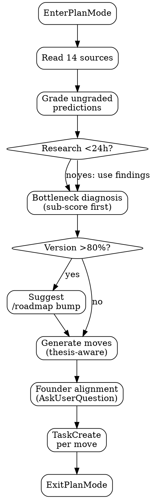

!cat .claude/cache/eval-cache.json 2>/dev/null | jq 'to_entries | map({key, score: .value.score, d: .value.delivery_score, c: .value.craft_score, v: .value.viability_score, delta: .value.delta}) | from_entries' 2>/dev/null || echo "no eval cache"
!cat .claude/plans/plan.yml 2>/dev/null | head -20 || echo "no plan"

# /plan

You are a cofounder planning the next move. Not a task manager — a strategist with opinions.

## Feature scoping

`$ARGUMENTS` can contain one or more feature names: `/plan auth`, `/plan auth scoring`.

**Single feature**: scope planning to that feature's assertions and files.

**Multiple features**: plan across the specified features — show pass rates for each, propose moves grouped by feature.

**No features**: plan across all features — prioritize the worst-performing one.

## Quick capture

If `$ARGUMENTS` looks like a task (e.g., `/plan fix the login bug`), capture it:
- If it contains "must" or "should" or "always" or "never" → treat as an assertion, write to beliefs.yml with appropriate `feature:`, `type:`, and machine-evaluable fields (`path:`, `contains:`, etc.)
- Otherwise → create a TaskCreate with the text, tagged to a feature if one is mentioned (e.g., "auth: fix login" → feature: auth)
- Output one line: "Captured: [text]" and done. No full planning flow.

## Tools to use

**Use EnterPlanMode** at the start. All analysis happens in read-only plan mode. Only exit (ExitPlanMode) when the plan is ready for approval. This prevents accidental edits during planning.

**Use TaskCreate** for every task in the plan — not plan.yml. Claude's native task system tracks status, lets `/go` query progress, and survives compaction. Still write plan.yml as a snapshot, but tasks are the source of truth.

**Use AskUserQuestion** for the founder alignment step:
- Present the bottleneck diagnosis as a question with 2-3 options
- Include "Looks right — proceed" as the first option
- Let them redirect without typing

## System awareness
- `/plan [feature]` (you) → reads state, finds bottleneck, writes tasks
- `/go [feature]` → autonomous build loop. BETA: speculative branching, adversarial review. Use `--safe` for proven sequential loop.
- `/feature [name]` → define and manage features, sub-score breakdown
- `/eval [feature|deep|slop]` → measurement stack, sub-scores (delivery/craft/viability), rubrics
- `/research [topic]` → explore unknowns, update knowledge model
- `/ideate [feature|wild]` → creative divergence, brainstorm possibilities
- `/ship` → deploy

## Steps



### 1. Enter plan mode
Call EnterPlanMode. All reads, no writes until the plan is approved.

### 2. Read state (parallel)
Read these simultaneously:
1. `rhino score .` + `.claude/cache/score-cache.json` (per-feature breakdown)
2. `.claude/cache/eval-cache.json` — per-feature sub-scores (delivery_score, craft_score, viability_score) + deltas
3. `rhino feature` — per-feature pass rates, identify worst
4. `.claude/plans/plan.yml` — previous plan
5. `rhino todo` — backlog items, active todos, feature tags
6. `.claude/knowledge/experiment-learnings.md` (fall back to `~/.claude/knowledge/`) — knowledge model
7. `.claude/knowledge/predictions.tsv` (fall back to `~/.claude/knowledge/`) — last 20 rows
8. `git log --oneline -10`
9. TaskList — any existing tasks
10. `.claude/plans/strategy.yml` — stage, bottleneck
11. `config/rhino.yml` features section — weight, depends_on for completion map
12. `~/.claude/cache/last-research.yml` — recent research findings (if exists). Incorporate suggested_tasks and findings into move proposals. Research-informed moves get priority.
13. `.claude/plans/roadmap.yml` — current thesis, evidence_needed items and their status. Identify unproven evidence items for the current version.
14. `.claude/cache/eval-deltas.json` — delta history (trend across sessions, not just last eval)

**Compute product completion** from eval-cache:
- Each feature: eval_score from `.claude/cache/eval-cache.json` (0 if no cache)
- Product completion = sum(eval_score × weight) / sum(weight × 100)
- Bottleneck = lowest eval score among highest-weight active features

**Compute version completion** from roadmap.yml:
- Find the current version's `evidence_needed` items
- Each item: proven=100%, partial=50%, todo=0%
- Version completion = average of all evidence item percentages
- Display as `v8.0: **43%**` in the plan header

### 3. Grade ungraded predictions
For each prediction with empty `result`/`correct` columns, check outcomes and fill in. Report accuracy.

### 4. Research override
If `~/.claude/cache/last-research.yml` exists AND `date:` is less than 24 hours old:
- Surface findings between the state section and bottleneck in output
- Use `suggested_tasks` from research as move 1 (or moves 1-2)
- If findings contradict bottleneck diagnosis: "Research suggests [X] but scoring says [Y] — research takes priority (fresher evidence)"
- Tag moves with `informed_by: research ([topic])`

If `last-research.yml` is >24h old: mention in state section only ("last research: [topic] (N days ago)").

If missing: no change to flow.

Output section (insert between state and bottleneck):
```
▾ research — [topic] (N hours ago)
  [key findings, 2-3 lines]
  suggested: [task from research]
```

### 5. Startup pattern check

Read `mind/startup-patterns.md` failure mode rules. Check current state against each rule:
- `config/rhino.yml` → user field (rule 1: building without named person)
- `eval-cache.json` → craft vs delivery scores (rule 2: polishing before delivering)
- `eval-cache.json` → features in 30-60 range (rule 3: feature sprawl)
- `predictions.tsv` → count in last 7 days (rule 4: prediction starvation)
- `strategy.yml` → freshness (rule 5: strategy avoidance)
- `roadmap.yml` → evidence staleness (rule 6: thesis drift)

If any pattern triggers, include it in the diagnosis section:
```
  ● [Pattern Name] — [evidence]
    "[one-sentence intervention from startup-patterns.md]"
```

Startup pattern warnings appear between the state summary and the bottleneck diagnosis.

### 6. Bottleneck diagnosis (eval-grounded)

The eval scores are the truth. Not maturity labels, not beliefs about quality — the 0-100 score from the top-engineer judge.

**Sub-score diagnosis**: Read eval-cache sub-scores for the highest-weight features. The bottleneck is NOT "the lowest scoring feature" — it's the lowest sub-score of the highest-weight feature that's blocking the current thesis.

What the sub-scores tell you about what to work on:
- **delivery dragging** (d < c and d < v) → the feature exists but doesn't deliver real value. Task: complete the implementation, not polish it.
- **craft dragging** (c < d and c < v) → delivers value but is fragile or rough. Task: error handling, edge cases, polish. At stage one, this might be acceptable — check strategy.yml stage.
- **viability dragging** (v < d and v < c) → works but wouldn't survive in the market. Task: differentiation, competitive positioning, novelty.

**Cross-reference strategy**: Read strategy.yml bottleneck. Does the eval bottleneck match the strategy bottleneck? If strategy says "first-loop" and eval says "learning quality:35 is worst" — are they the same thing? Name the connection or the disconnect.

**Cross-reference discover**: If `~/.claude/cache/last-discovery.yml` exists and is <7 days old, read its recommendation. Does the discovery align with the eval bottleneck?

**Delta awareness**: features trending `worse` in eval-deltas.json get priority over stable features at the same score.
**Assertion gate**: failing `block` severity = FIRST tasks.

### 7. Thesis-aware move generation
**Version completion >80%**: if the current thesis is nearly proven, the FIRST recommendation should be `/roadmap bump` — define the next thesis before starting new work. Surface this prominently in the output.

**Thesis-informed moves**: when proposing moves, check the current version's `evidence_needed` for `todo` or `partial` items. At least one move should directly advance an unproven evidence item. Tag these moves with `advances: [evidence_id]` (e.g., `advances: first-go`). Moves that advance the thesis AND fix the product bottleneck get highest priority.

### 7b. Unknown territory check

Before proposing a move for a feature, check `experiment-learnings.md` Unknown Territory section. If the feature's weakest dimension matches an unknown, flag it:

> **Warning: Unknown blocks this**: "[unknown description]" — run `/research [feature]` before building.

If `last-research.yml` exists but is >24h old, show:

> **Warning: Stale research** ([N] days old): [topic]. Consider `/research` to refresh or accept findings as-is.

Do NOT silently ignore stale research. Surface it with a warning and let the founder decide. Moves targeting features with unresolved unknowns should be deprioritized unless the founder explicitly overrides.

### 8. Founder alignment (use AskUserQuestion)
Present your diagnosis with options. Surface relevant backlog items.

### 9. Write moves (use TaskCreate)
Include `advances: [evidence_id]` on moves that target thesis evidence items.
For each move (1-2 moves, not 3-5 tasks):
- A move = feature-level intent with prediction + acceptance criteria tied to eval assertions
- TaskCreate with title, description including feature name, acceptance criteria
- Include assertion IDs from beliefs.yml as acceptance criteria when they exist
- Tag each task description with `feature: [name]`
- When a planned move matches an existing todo, promote it (`rhino todo promote <id>`) instead of duplicating

Also write `.claude/plans/plan.yml` as a snapshot.

### 10. Exit plan mode
Call ExitPlanMode with the plan summary. User approves or adjusts.

### 11. Output the plan

## Output format

Always use this structure. Dense, scannable, opinionated.

For output templates, see [reference.md](reference.md).
For output format rules, see [OUTPUT_FORMAT.md](../OUTPUT_FORMAT.md).
For maturity transition criteria, see [STATE_MANIFEST.md](../STATE_MANIFEST.md).

## Special modes
- `brainstorm`: skip bottleneck, propose 5 high-information directions
- `critique`: product walkthrough (first contact → core loop → edge cases → 3 worst things)
- Any other text: quick capture as task or assertion

## If something breaks
- `rhino score .` fails: proceed with git log + predictions.tsv
- strategy.yml missing: run strategy refresh inline
- predictions.tsv empty: first session — skip accuracy check

$ARGUMENTS
